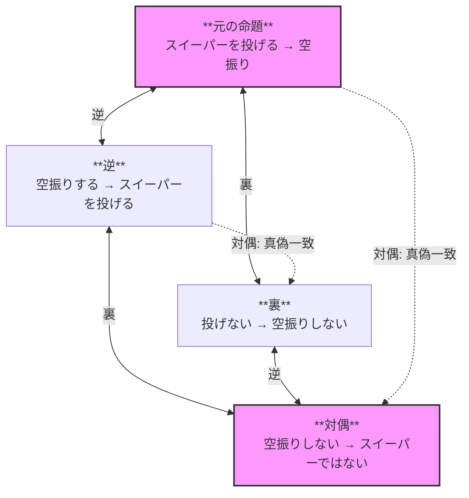

# 第5回 集合と論理：Pythonで動かす「思考の整理学」

## 0. イントロダクション：集合論とは？

数学の世界では、ある条件を満たすものの集まりを **「集合（Set）」** と呼び、その中に入っている一つひとつの材料を **「要素（Element）」** と呼びます。

エンジニアリングにおいて集合論が重要な理由は、**「複雑な条件を整理し、必要な情報だけをミスなく抽出するため」** です。

- **3D CAD**: 「円柱」から「立方体」を引いて穴をあける（ベン図の差集合）
- **データ分析**: 数百万人の顧客データから「20代」かつ「東京在住」を抜き出す（ベン図の積集合）

> **📊 今回使用するデータの出典について**  
> 演習で使用する大谷翔平選手の投球データは、MLB公式の解析システム **「Statcast（スタットキャスト）」** の数値を参考にしています。これらは **「Baseball Savant」** というサイトで公開されており、世界中のアナリストが分析に活用している「生きたデータ」です。

---

## 1. Python の set 型：最大の特徴は「重複を許さない」こと

Pythonで集合を扱うには `{ }`（波括弧）を使います。
数学の集合の最も重要なルールは **「同じ要素は2つ以上存在できない（一意性）」** という点です。

```python
# リスト（[ ]）は重複を許すが、セット（{ }）は重複を消す
data_list = [1, 2, 2, 3, 3, 3]
data_set = {1, 2, 2, 3, 3, 3}

print(f"リスト: {data_list}")  # [1, 2, 2, 3, 3, 3]
print(f"セット: {data_set}")   # {1, 2, 3} ← 重複が自動で一つになる！

```

> **💡 エンジニア・メモ：重複削除の自動化**
> 大量のログデータから「今日アクセスしてきたユーザーIDの数（ユニークユーザー数）」を知りたいとき、Pythonではリストを `set()` 関数に放り込むだけで一瞬で重複が消え、計算が完了します。

---

## 2. 演習：大谷翔平の「最強の球種」を特定せよ（出典：Statcast）

大谷選手の多彩な変化球を集合に見立てて、特定の条件に合うボールを抽出してみましょう。

```python
# 全球種（Statcastによる分類）
pitches = {"フォーシーム", "スイーパー", "スプリット", "シンカー", "カットボール", "カーブ"}

# 特徴別の集合
high_speed = {"フォーシーム", "シンカー", "スプリット"} # 150km/h以上
horizontal = {"スイーパー", "シンカー"}                # 横の変化が大きい
killer_ball = {"スイーパー", "スプリット"}              # 空振り率が高い（魔球）

# 1. 積集合（&）：速くて、かつ横に曲がる球（フロントドア）は？
print(high_speed & horizontal)  # {'シンカー'}

# 2. 差集合（-）：速くないし、魔球でもない球（カウント用）は？
print(pitches - high_speed - killer_ball)  # {'カットボール', 'カーブ'}

# 3. 和集合（|）：速いか、または、横の変化が大きい球種は？
print(high_speed | killer_ball)  # {'スイーパー', 'スプリット', 'シンカー', 'フォーシーム'}
```

---

## 3. 可視化：ベン図（Venn Diagram）とは？

集合の関係性を視覚的に表す最も有名な方法が **「ベン図」** です。

* **ベン図とは？**: 19世紀の数学者ジョン・ベンが考案しました。複数の集合が「どこで重なっているか」を円を使って示します。
* **なぜ使うのか？**: 集合が3つ以上になると、頭の中だけで重なりを把握するのは困難です。図に描くことで、データの全体像を一瞬で理解できます。

### ⚠️ Google Colab を使う際の注意

Google Colab では、ブラウザを立ち上げる（ランタイムを再起動する）たびに、追加ライブラリのインストールが必要です。

```python
# Google Colab で実行する場合
!pip install matplotlib-venn
!pip install matplotlib-venn japanize-matplotlib
```

### ベン図の描画コード

```python
import matplotlib.pyplot as plt
from matplotlib_venn import venn3

# 大谷選手のデータで描画
plt.figure(figsize=(8, 8))

# 並び順が決まってる：A, B, AB, C, AC, BC, ALL
venn3([high_speed, horizontal, killer_ball], 
      set_labels=('High Speed', 'Horizontal', 'Killer Ball'))

plt.title("Shohei Ohtani's Pitch Analysis (Data: Statcast)")
plt.show()

```

### 練習

以下のベン図を書いてみよう。

### 1. 【バイト・仕事選び】のベン図

* **円A：** 給料が良い
* **円B：** 楽（あるいは人間関係が良い）
* **円C：** やりがいがある  

**重なりの結論：**

* $A \cap B \cap C$ （全部重なる場所）＝ **「存在しない（都市伝説）」**
* $A \cap B$ （高給で楽）＝ **「怪しい勧誘」**

```python
from matplotlib import pyplot as plt
from matplotlib_venn import venn3
import japanize_matplotlib

# ベン図の作成（サイズは適当な重なりを指定）
v = venn3(subsets=(1, 1, 1, 1, 1, 1, 1), 
          set_labels=('給料が高い', '楽すぎる', 'やりがい'))

# 各領域のテキストを「あるある」で上書き
v.get_label_by_id('100').set_text('激務\n(心折れる)') 
v.get_label_by_id('010').set_text('暇すぎて\n苦痛')
v.get_label_by_id('001').set_text('ただの\nボランティア')

v.get_label_by_id('110').set_text('闇バイト\n(絶対ダメ)') # 給料高×楽
v.get_label_by_id('011').set_text('サークル活動')        # 楽×やりがい
v.get_label_by_id('101').set_text('ベンチャー企業')      # 給料高×やりがい

# 一番大事な「真ん中」
v.get_label_by_id('111').set_text('存在しない\n(都市伝説)')

plt.title("若者が直面する『仕事選び』の理想と現実")
plt.show()
```

### 2. 【マッチングアプリ・出会い】のベン図

* 円A： 顔が良い（清潔感・ビジュアル）
* 円B： 性格が良い（価値観・誠実さ）
* 円C： 未婚・独身（フリーであること）

**重なりのオチ（中心）：**

以下のオチを考えよ。

* $A \cap B$（顔も性格も良い） ＝ 
* $A \cap C$（顔が良くて独身） ＝ 
* $A \cap B \cap C$ ＝ 

### 3. 問

あるマッチングアプリでいいなと思った相手 100 人を調査したところ、以下の条件に当てはまる人数が分かりました。

* 「顔が良い」：45人
* 「性格が良い」：40人
* 「独身である」：50人

また、2つの条件を同時に満たす人数は以下の通りです。

* 「顔が良い」かつ「性格が良い」：15人
* 「性格が良い」かつ「独身である」：12人
* 「顔が良い」かつ「独身である」：18人

さらに、3つ全ての条件を満たす人は5人でした。

1. このとき、ベン図の中央（3つ全てを満たす）を除いた、「顔が良く、性格も良いが、独身ではない（既婚者など）」の人数は何人ですか？
2. どれか1つでも条件（顔・性格・独身）に当てはまっている人は、合計で何人いますか？
---

## 4. SPI攻略：3集合の数え上げ（SNS調査を例に）

### 【問題】学生100人のSNS利用調査

* 32 人が **X (エックス)** を利用している。
* 20 人が **Instagram** を利用している。
* 45 人が **TikTok** を利用している。
* 15 人が X と TikTok を利用している。
* 7 人が X と Instagram を利用している。
* 10 人が Instagram と TikTok を利用している。
* 30 人が 3つの SNS のどれも利用していない。

---

### 問 1. SNS 3 つとも利用している学生の数を求めよ。

以下を読まずにまずは５分考えてみましょう。

#### 「ダブり」を調整して人数を計算する

3つのSNSのいずれかを使っている合計人数（和集合）は **100人 - 30人 = 70人** です。
この「70人」を基準に、未知数（3つすべて利用）を求めるロジックを組み立てます。

<div align="center">

</div>

1. **単純に全部足す**: `(x + i + t)`
    * 2つ重なっているところは **2回（ダブル）**、3つ重なっているところは **3回（トリプル）** カウントされてしまっています。

2. **2つの重なりを引く**: `(x + i + t) - (xi + xt + it)`
   * これでダブルカウントが解消されました。
   * しかし、3つ重なっている場所は「3回足して、3回引いた」結果、**0回（カウントなし）** になってしまいました。

3. **最後に3つの重なりを足す**: `(x + i + t) - (xi + xt + it) + unknown`
   * これで全ての領域が正しく1回ずつ数えられ、合計（70人）と一致します。

```python
# 1. 値の定義
total, none = 100, 30
x_total, i_total, t_total = 32, 20, 45
xi_overlap, xt_overlap, it_overlap = 7, 15, 10

# 2. 数え上げのロジック
union = total - none
unknown = union - (x_total + i_total + t_total) + (xi_overlap + xt_overlap + it_overlap)

print(f"【解答1】3つすべて利用している学生: {unknown} 人")
```

### 問 2. どれか一つだけを利用している学生の数の合計を求めよ。

```Python
# 各領域の純粋な人数

xi_only = xi_overlap - unknown # X/Instgram 
xt_only = xt_overlap - unknown # X/TikTok
it_only = it_overlap - unknown # Instagram/TikTok

x_only = x_total - (xi_only + xt_only + unknown)
i_only = i_total - (xi_only + it_only + unknown)
t_only = t_total - (xt_only + it_only + unknown)

print(f"【解答2】ちょうど1つだけ利用している学生: {x_only + i_only + t_only} 人")
```

### #3. ベン図による可視化

```python
from matplotlib_venn import venn3
import matplotlib.pyplot as plt

plt.figure(figsize=(8, 8))
# subsets=(Xのみ, Iのみ, XIのみ, Tのみ, XTのみ, ITのみ, 全部)

venn3(subsets=(x_only, i_only, xi_only, t_only, xt_only, it_only, unknown), 
      set_labels=('X', 'Instagram', 'TikTok'))

plt.title("SNS Usage Survey (n=100)")
plt.show()
```

---

## 5. 論理の型：逆・裏・対偶


### 論理の構造図



* **対偶の法則**: 元の命題が「真」なら、対偶も必ず「真」になる。
* **エンジニアの視点**: 「エラーが出たなら、どこかが正常ではない（バグがある）」という対偶思考こそが、トラブルシューティングの原点です。

```

```