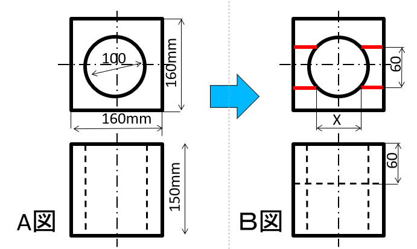
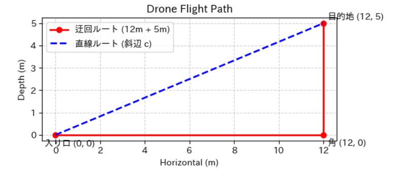
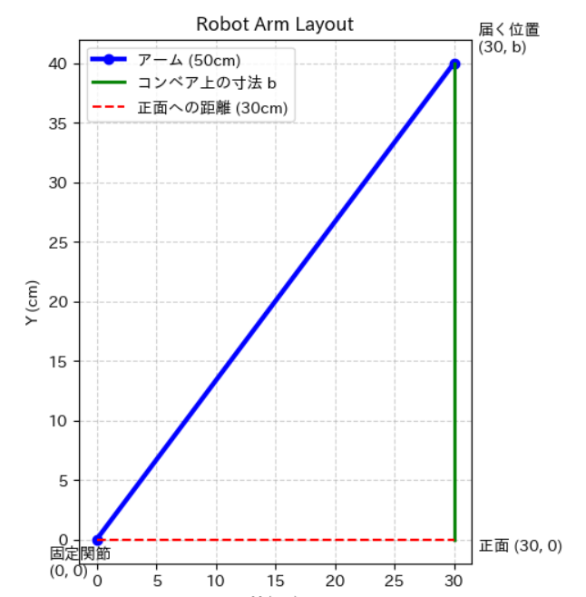
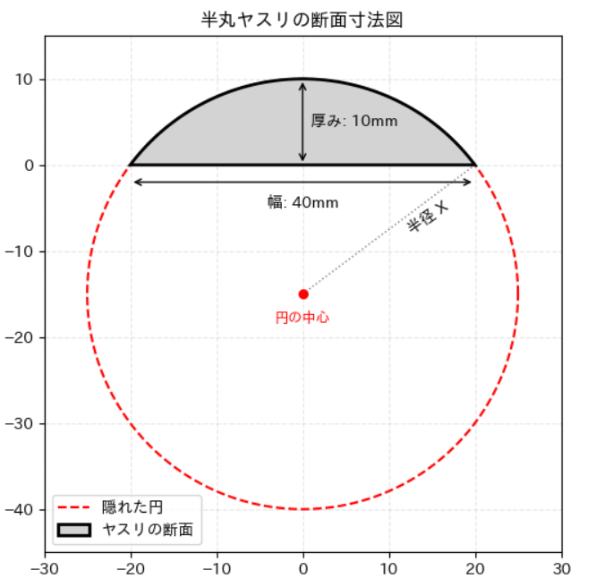

# 工業数学 第7回：関数とグラフ
―― 数式を「形」にして、物理空間・加工現場を支配する ――

## 1. 関数の基本イメージ：何かを入れると、何かを返す「変換器」

数学における「関数」を英語で言うと **Function（ファンクション）** です。これは「機能」や「作用」を意味します。
教科書の退屈な計算式だと思うのをやめて、コンピュータや機械の中にある **「数値を放り込むと、決まったルールで別の数値に変えて吐き出す土管（変換器）」** をイメージしてください。

$x$ をなんかごにょごにょっとやって、$y$ にする：

$$y = f(x)$$

このとき、多くのケースにおいて $x$ は変化します：

* **$y = 3x + 5$** （1次関数の土管）
    * 卵1パック 100 円を $x$ パック買い、レジ袋 $5$ 円を足して合計金額 $y$ 円を出す機能。
    * $x = 3$ を入れると、中で $100 \times 3 + 5$ が実行され、 $y = 305$ が出てくる。
    
* **$y = \sin \theta$** （三角関数の土管）
    * 角度 $\theta$ を入れると、その瞬間の「波の高さ $y$」を返す機能。
    * $\theta = 30^\circ$ を入れると $y = \frac{1}{2}$ が出てき、 $\theta = 45^\circ$ を入れると $y = \frac{\sqrt{2}}{2}$ が出てくる。

> **💡 コラム：関数と「方程式」の違いって？**
> * **関数**は、あらゆる入力に対して出力が連動して変わる「**仕組み（土管そのもの）**」のこと。
> * **方程式**は、「出力が305円のとき、卵の値段 $x$ はいくらだった？」という特定の答えを逆算して突き止める「**クイズ（謎解き）**」のこと。

## 2. 導入：テキストで波（サインカーブ）を描く

関数の変化はグラフに描くとわかりやすいです。たとえば、サイン波。専用の高度なグラフ描画モジュールを使わなくても、簡単な計算と「空白（スペース）の数」を制御するだけで、画面に物理的な「波の形」を浮かび上がらせることができます。

### 練習コード

Google Colabに以下のコードを貼り付けて実行してみましょう。
```python
# むかしはこうやっていました！
import math

for i in range(20):
    # 数式から「空白の数」を計算する（関数が形を作る基本）
    s = int(10 + 10 * math.sin(i / 3))
    print(" " * s + "*")

```

> **講義のポイント：**
> 計算結果（出力）の数だけスペースを空けて「*」を打っているだけです。数式（`math.sin`）というルールが、物理的な波の形を作り出している本質を理解しましょう。

---

## 3. 工業で多用する「1次関数」の構造

実務の現場で最も登場するのが1次関数です。先ほどの買い物の例と同じ構造をしています。

$$y = ax + b$$

* **傾き ($a$) ＝ 変換の感度**  
入力「$1$」に対して、出力がどれだけ敏感に反応するか（ゲイン）。

* **切片 ($b$) ＝ 基準のズレ（オフセット）**  
制御の世界では「基準のズレ」を意味します。入力がゼロの時のスタート地点。

### 実践例：センサーの「校正」と「風袋引き（補正）」

荷重センサー（ロードセル）から電圧を入力し、重さに変換するルールを作ります。

* $0\text{V}$ のとき $\rightarrow$ $0\text{kg}$
* $5\text{V}$ のとき $\rightarrow$ $100\text{kg}$

#### 【計算】

傾き $a = 100\text{kg} \div 5\text{V} = 20 \rightarrow y = 20x$

もし、$10\text{kg}$ の「カゴ」を載せたまま計測を始める（風袋引きが必要な）場合、初期状態で $10\text{kg}$ のズレ（オフセット）があるため、切片 $b$ を使って式を補正します。

補正後の式： **$y = 20x + 10$**

> ⚠ 風袋引き（ふうたいびき）とは、ものを量る際に、容器や包装紙などの重さ（風袋）をあらかじめ差し引き、中身だけの正しい重さ（正味量）を求める操作や機能のことです。

---

## 4. Pythonワーク：コードを動かして「ズレ（切片）」を直そう

デジタル方眼紙モジュール `matplotlib` を使って、実際に数式を動かします。

### 実験コード

以下のコードの `b = 0` の部分を、`10` や `-5` に書き換えて実行し、グラフ（直線）が上下にどうシフトするかを確認してください。

```python
import matplotlib.pyplot as plt
import numpy as np

x = np.linspace(0, 5, 100) # 0Vから5Vまで100分割

a = 20  # センサーの感度
b = 0   # ★ここを 10 や -5 に書き換えて実行してみよう

y = a * x + b

plt.plot(x, y)
plt.grid(True, linestyle="--")
plt.xlabel("Voltage (V)")
plt.ylabel("Weight (kg)")
plt.show()

```
---

## 5. 三平方の定理の基本：斜辺（最短距離）を求める

ここからは、2次元の物理空間を支配するルールを学びます。古代エジプトで生まれた三平方の定理（ $a^2 + b^2 = c^2$ ）は、現代のナビゲーションや地図アプリ（GPS）において「座標平面の上で、2点間の最短距離（直線距離）を測るメジャー」として使われています。

### 斜辺（最短距離 $L$）を求める公式

直角を挟む2辺の長さ（横の差 $x$、縦の差 $y$）が分かっているとき、一番長い斜辺 $L$ は以下の式で計算できます。

$$L = \sqrt{x^2 + y^2}$$

### 基本演習：地球を「平面」とみなして、広島ー東京の距離を測る

> **【問題】**  
> 地球は丸いですが、今回はあえて「巨大な平面の方眼紙」だと仮定します。  
> 広島と東京の緯度・経度は以下の通りです。2点間の直線距離 $L$ は何 $\text{km}$ になるでしょうか。
> * **広島：** 北緯 $34.4^\circ$ ／ 東経 $132.5^\circ$
> * **東京：** 北緯 $35.7^\circ$ ／ 東経 $139.7^\circ$  
> 
> ※ヒント：日本付近では、**緯度 $1^\circ \approx 111\text{ km}$**、**経度 $1^\circ \approx 91\text{ km}$** として距離に換算できます。

#### 【計算アプローチ】

1. **縦（緯度）の差 $y$ を出す**  
$$35.7^\circ - 34.4^\circ = 1.3^\circ$$

距離に直すと： $1.3 \times 111\text{ km} \approx 144.3\text{ km}$

2. **横（経度）の差 $x$ を出す**  
$$139.7^\circ - 132.5^\circ = 7.2^\circ$$

距離に直すと： $7.2 \times 91\text{ km} \approx 655.2\text{ km}$

3. **三平方の定理で斜辺 $L$ を出す**  　
$$L = \sqrt{655.2^2 + 144.3^2} = \sqrt{429287 + 20822} = \sqrt{450109} \approx 671\text{ km}$$

**答： 約 $671\text{ km}$** 

実際の正確な球体上の直線距離は約　$675\text{ km}$ なので、平面近似でもほぼ正確な値が出ます！

スマホの地図アプリが2点間の距離をパッと表示できるのも、裏でこの三平方の定理の土管が超高速で動いているからです。

---

## 6. 【現場応用演習】図面から直角三角形を切り出す（寸法逆算）

基本を理解したら、実際の加工現場の図面を読み解きましょう。現場では、斜辺ではなく「隠れた直角三角形から、底辺や高さ（加工寸法）を逆算する」という使い方がメインになります。

### 応用問題：機械加工における干渉幅 $X$ の算出

> **【問題】**
> 直経 $\phi 100\text{mm}$（半径 $50\text{mm}$）の円穴が通ったブロックがある。
> この品物に、図面通り幅 $60\text{mm}$ の溝（中心から片側 $30\text{mm}$）を加工したとき、円穴と溝が交差する位置の幅 $X$ は何 $\text{mm}$ になるか。

<div align="center">

</div>

**賢明な君は以下を見ずに、考えているだろう。**

### 解答・アプローチ

図面の中に「**斜辺が半径 $50\text{mm}$**」「**底辺が溝の半幅 $30\text{mm}$**」の直角三角形を見つけ出すのがエンジニアの目です。

今回は未知の「高さ」を求める逆算になります。

$$50^2 = 30^2 + \left(\frac{X}{2}\right)^2$$

$$2500 = 900 + \frac{X^2}{4}$$

$$\frac{X^2}{4} = 1600 \rightarrow X^2 = 6400$$

$$\frac{X}{2} = 40 \rightarrow X = 80\text{mm}$$

**答： $80\text{mm}$**
このように、図面から直角三角形を切り出すことで、干渉する正確な寸法 $X$ を導くことができます。

---
## 7. 荒技実験：三角形を敷き詰めて「ロボットの可動領域（円）」を作る

先ほどの演習では広島ー東京間の直線距離や図面から干渉幅の長さ（斜辺 $r$）を求めるために三平方を使いました。
今度は、アームの長さ（斜辺 $r$）を固定したまま、底辺（$x$）を力技で少しずつ変化させてみましょう。
三平方の定理を $y$（高さ）について解くと、以下のようになります。

$$y = \pm\sqrt{r^2 - x^2}$$

$x$ の刻み幅（`step_size`）をどんどん細かくしていくと、アームの先端の軌跡がどう変化するかを実験します。

### 実験コード

上部にある **`step_size = 1.0`** の数値を、`2.0` $\rightarrow$ `1.0` $\rightarrow$ `0.5` $\rightarrow$ `0.1` と段階的に小さくして、何度も実行してみてください。

コンピュータは最初から綺麗な「円」を描いているわけではありません。

「$x$ を動かし、三平方の定理から $y$ を計算して点を打つ」という泥臭い計算を高速で繰り返しているだけです。

そして、その直角三角形の隙間を無限に細かく敷き詰めた結果、現れる境界線こそが **円の方程式（$x^2 + y^2 = r^2$）** であり、多関節ロボットが物理的にそれ以上外へ動いてはいけない「**作業領域の壁（リミットライン）**」を定義しているのです。

## 【ミニ演習】三平方の定理を使って空間の寸法をハックする

「三平方の定理（ $a^2 + b^2 = c^2$ ）」を使って、設計や現場でよくある「空間の寸法」を割り出す問題を3つ解いて、頭のウォーミングアップをしましょう。

### 🚀 ミニ演習1：レスキュー・ドローンの直線飛行ルート（斜辺を求める）
> **【問題】**
> 工場の入り口から、奥にある目的地までドローンを直線で飛行させたい。
> 事前にマニュアルで機体を移動させたところ、「横に $12\text{m}$ 進んでから、直角に折れて奥へ $5\text{m}$ 進む」というルートをたどった。
> 
> この入り口から目的地までを完全に直線で結んだとき、その直線ルートの飛行距離は何 $\text{m}$ になるか求めよ。

<div align="center">

</div>

#### 【解答・解説】

これは直角を挟む2辺が $12\text{m}$ と $5\text{m}$ の直角三角形の、斜辺 $c$ を求める問題です。
三平方の定理より：

$$c^2 = 12^2 + 5^2 = 144 + 25 = 169$$

$169$ は $13$ の2乗（ $13 \times 13 = 169$ ）なので、ルートを外すと $c = 13$ となります。

**答： 直線ルートの距離は $13\text{m}$**

---

### 🤖 ミニ演習2：ロボットアームの配置設計（残りの1辺を逆算する）

> **【問題】**
> 工場の組み立てラインに、長さがぴったり $50\text{cm}$ のアームを持つ固定式のロボットを配置する。
> このロボットを、作業対象となるベルトコンベアのラインから真横に $30\text{cm}$ 離れた位置（下図の固定関節の位置）にボルトで固定した。
> アームをピンとまっすぐ伸ばしてコンベア上の部品に手を届かせるとき、図の「届く位置」のコンベア上の寸法（高さ $b$）は何 $\text{cm}$ になるか逆算せよ。

<div align="center">

</div>

#### 【解答・解説】

今回は、斜辺（アームの長さ）が $50\text{cm}$ 、底辺（真横の距離）が $30\text{cm}$ と分かっていて、直角三角形の「高さ $b$」を逆算する問題です。
三平方の定理より：

$$30^2 + b^2 = 50^2 \rightarrow 900 + b^2 = 2500 \rightarrow b^2 = 1600$$

$1600$ は $40$ の2乗（ $40 \times 40 = 1600$ ）なので、$b = 40$ となります。
（※工学で超頻出の「 $3 : 4 : 5$ 」の直角三角形の比率を10倍した形です）

**答： 寸法 $b$ は $40\text{cm}$**

### 🚀 ミニ演習3：半丸ヤスリの形状設計（背後に隠れた円の半径）
> **【問題】**
> 金属加工で使う「半丸ヤスリ」がある。このヤスリの断面の寸法を測ったところ、平らな面の幅が $40\text{mm}$、一番厚い部分の厚みが $10\text{mm}$ であった。
> このヤスリのカーブ（円弧）の元になっている、背後に隠れた円の半径 $X\text{mm}$ はいくらになるか。三平方の定理を使って算出せよ。

<div align="center">

</div>

#### 【解答・解説】

**最後は自力で！**