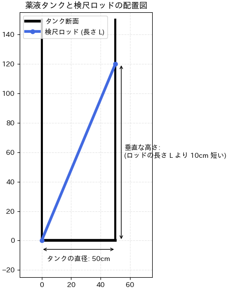
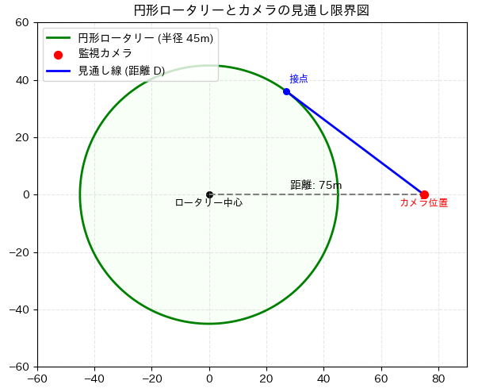
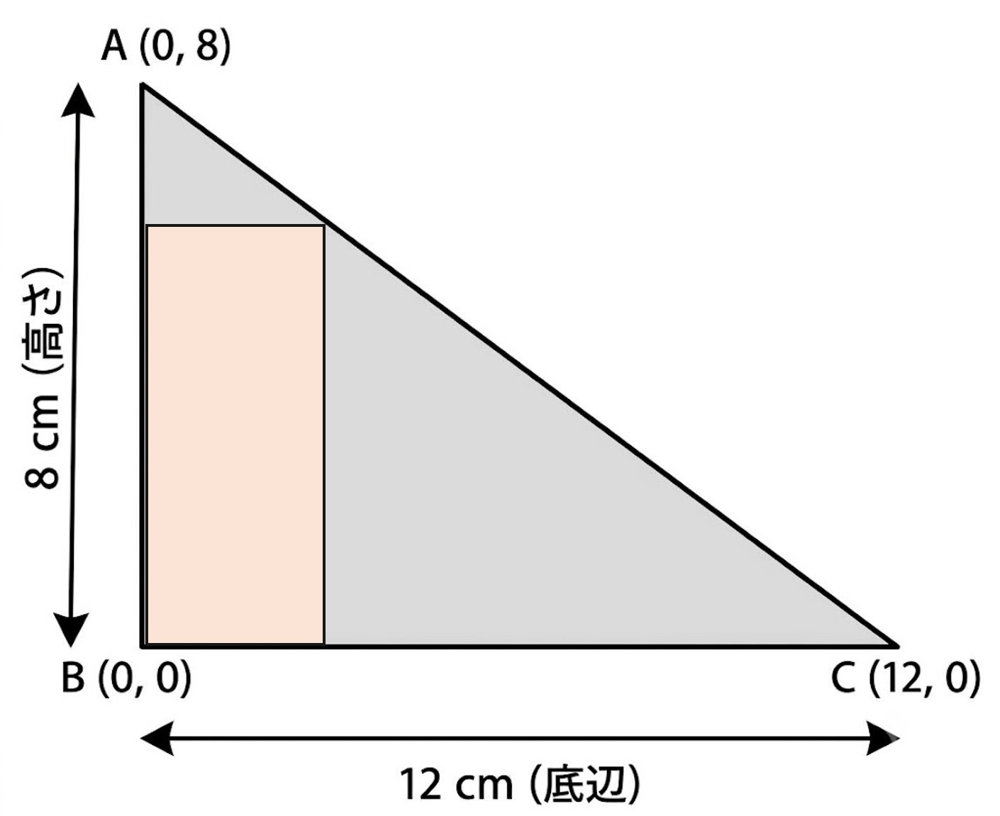
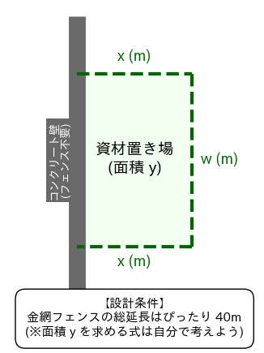

# 第7回・第8回 合同提出課題：

- 本講義の課題は、**Google Colab** で作成したノートブック（.ipynb）を **Google Classroom** へ提出します。
- 以下の内容を1つのノートブックにまとめ、期限までに提出してください。
- テキストセルとコードセルを使って、わかりやすくレイアウトしてください。
- **提出先**: Google Classroom の指定された課題「第7回・第8回合同課題」にファイルを添付して提出。
  1) [ファイル] > [ダウロード] > [.ipynb をダウンロード]
  2) ダウンロードフォルダにある `工業数学_7_8_合同課題_学籍番号_氏名.ipynb` を提出する。

## 三平方の定理を用いた構造・配置設計

いずれの問題も、提示された Python コードを Google Colab に貼り付けて実行し、出力される正確な寸法図を観察しながら解答すること。

---

### 📋 課題1：【プラント設備設計】薬液タンク内の検尺ロッド（代数展開型）
**【問題】**
 
直径 $50\text{cm}$ の円柱形薬液タンクがある。この中に、タンクの深さを測るための真っ直ぐな金属製のロッド（棒）を斜めに立てかけた。
 
ロッドの下端はタンクの底の隅（壁のキワ）にあり、ロッドの上端は反対側の壁にぴったり寄りかかっている。
このとき、タンクの底からロッドの上端までの垂直な高さは、**ロッドの長さそのものよりも $10\text{cm}$ 短く**なっていた。
 
 三平方の定理を用いて、この検尺ロッドの長さ $L\text{cm}$ を算出せよ。
  （忍者もこの方法で堀の深さを測ったと言われている）

### 📋 課題2：【都市・交通工学】円形ロータリーと監視カメラの見通し線（幾何発見型）

**【問題】**  

あるスマートシティの交差点に、半径 $45\text{m}$ の円形ロータリー（中央の緑地帯）がある。
このロータリーの中心からまっすぐ $75\text{m}$ 離れた位置に、交通監視用の高精度カメラが設置されている（下図の赤点）。
カメラからロータリーの縁（円周）に向かって視線を走らせ、視線がロータリーの境界にちょうど「接する」ような見通し線（青線）を計画した。カメラの位置から、ロータリーと視線が交わる「接点」までの直線距離 $D\text{m}$ はいくらになるか。三平方の定理を用いて算出せよ。

（※ヒント：中学校で習った『円の接線は、接点を通る半径とどのように交わるか』という幾学のルールを思い出そう！）

## 2次関数の工学的応用（最大値の設計）

今回の授業で学んだ「2次関数の最大・最小（平方完成）」を応用し、設計や実験の現場で直面する3つの最適化課題を解決せよ。

### 📋 課題1：【機械】切り出し可能な最大面積の算出

**【問題】**
下の図のように、底辺 $12\text{cm}$、高さ $8\text{cm}$ の直角三角形の材料から、内側にぴったり収まるような長方形のブロックを削り出したい。長方形の縦の長さを $x\text{cm}$、横の長さを $w\text{cm}$ とする。

1. 三角形の相似の関係を利用して、長方形の横の長さ $w$ を、縦の長さ $x$ を用いた式で表せ。
2. 長方形の断面積を $y\text{cm}^2$ とするとき、 $y$ を $x$ の2次関数として表せ。
3. この式を、雨樋の例にならって平方完成させる Python コードを記述せよ。
4. 計算によって出力された「平方完成された式」と、そこから読み取れる「最大面積になる縦の長さ $x$ 」をレポートに記述して提出すること。

### 📋 課題2：【建築・土木工学】壁面を利用した資材置き場の最大面積設計

**【問題】**

工場の敷地内にある長い直線状のコンクリート壁を利用して、資材置き場となる長方形のエリアを金網フェンスで囲むことになった。手元にあるフェンスの総延長はぴったり 40m である。壁側の1辺にはフェンスを張る必要がない（残りの3辺にフェンスを張る）ものとする。長方形の、壁に垂直な側の辺の長さを $x\text{m}$ と置く。

1. 【立式】 資材置き場の面積を $y\text{m}^2$ とするとき、 $y$ を $x$ の2次関数の式（一般形 $y = ax^2 + bx$）で表せ。
2. 【平方完成】 1で求めた式を、sympy を使って平方完成（標準形 $y = a(x - p)^2 + q$）に変形せよ。
3. 【グラフ描画】 以下の Python コードの 【ここに、自分で平方完成した数式を入力】 の部分を、2で自分が求めた数式（Pythonの文法）に書き換えてGoogle Colabで実行し、グラフを描画せよ。出力されたグラフを観察し、「面積が最大になるときの縦の長さ $x$ 」 と 「そのときの最大面積 $y$ 」 をレポートに記述せよ。

### 📋 課題3：【電気・エネルギー工学】ソーラーパネルの最大電力供給設計

**【問題】** 

ある太陽光パネル（直流電源）の特性を実験室で測定したところ、回路に流す電流 $x\text{ [A]}$ と、そのとき出力される電圧 $V\text{ [V]}$ の間に、 $V = 12 - 2x$ という関係があることが分かった。このパネルから取り出せる電力（消費電力）を $y\text{ [W]}$ とするとき、電力を最大にするための最適な電流値を設計したい。なお、電力は「$\text{電圧} \times \text{電流}$（ $y = V \times x$ ）」で計算される。

1. 【立式】 電力を $y$、電流を $x$ とするとき、 $y$ を $x$ の2次関数の式（一般形）で表せ。
2. 【平方完成とグラフ描画】 以下の Python コードの 【ここに、1で考えた元の式を入力】 の部分を書き換えてGoogle Colabで実行せよ。
3. 計算・出力されたグラフを観察し、「電力が最大になるときの電流値 $x$ 」 と 「そのときの最大電力 $y$ 」 をレポートに記述せよ。

**【自由記述】**  
今回のように、コンピュータ（Python / SymPy）を使って「数式を視覚化（グラフ化）する」ことには、工学の設計や実験においてどのようなメリットがあると考えられますか。手計算だけのときと比較して、気づいたことや感じたことを自由に述べよ。
