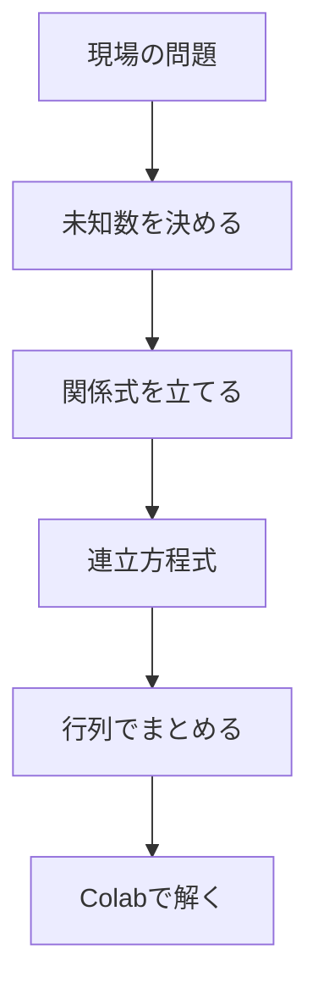
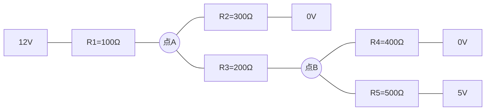

# 第14回 行列と解析：連立方程式を「一撃で解く」

### ー 回路網・力のつり合い・配管網を、同じ形の計算として扱う ー

---

## ⏱ 授業時間の目安（100分授業・正味85分）

| 時間 | 内容 |
|---:|---|
| 0〜5分 | 今日のゴール、前回のベクトルとのつながり |
| 5〜20分 | 連立方程式とは何か |
| 20〜35分 | 行列の形 $A\vec{x}=\vec{b}$ にまとめる |
| 35〜55分 | `np.linalg.solve()` で連立方程式を解く |
| 55〜75分 | 電気回路のノード電圧を求める |
| 75〜85分 | ミニ確認・第15回への接続 |

---

## 🎯 今日のゴール

今日の授業では、次のことを目標にします。

1. 連立方程式を、行列の形にまとめて考えられるようになる。
2. Google Colab の `np.linalg.solve()` を使って、未知数をまとめて求められるようになる。
3. 電気回路のような複雑な関係も、式を立てれば計算機で解けることを体験する。
4. 次回のシミュレーションで使う「計算を自動化する」感覚を身につける。

---

## 1. 連立方程式は、現場でよく出てくる

工業の問題では、「未知数が1つだけ」ということはあまり多くありません。

たとえば、次のような問題では、複数の未知数が同時に出てきます。

- 複数の抵抗がつながった回路の電圧
- 複数の部材に分かれる力
- 複数の配管に分かれる流量
- 複数の工程が関係する生産量

これらは、見た目は違っても、数学的にはよく似ています。



---

## 2. まずは普通の連立方程式から

次の連立方程式を考えます。

$$
\begin{cases}
2x+y=7 \\
x+3y=11
\end{cases}
$$

手計算でも解けますが、今日は行列を使います。

この式は、次の形にまとめられます。

$$
\begin{bmatrix}
2 & 1 \\
1 & 3
\end{bmatrix}
\begin{bmatrix}
x \\
y
\end{bmatrix}
=
\begin{bmatrix}
7 \\
11
\end{bmatrix}
$$

短く書くと、

$$
A\vec{x}=\vec{b}
$$

です。

---

## 3. ワーク1：Colabで連立方程式を解く

```python
import numpy as np

A = np.array([
    [2, 1],
    [1, 3]
])

b = np.array([7, 11])

answer = np.linalg.solve(A, b)

print(answer)
```

出力結果は、

```text
[2. 3.]
```

となります。

つまり、

$$
x=2,\quad y=3
$$

です。

---

## 4. 行列の見方

行列は、難しいものではありません。

係数だけを表にまとめたものです。

$$
\begin{cases}
2x+y=7 \\
x+3y=11
\end{cases}
$$

この左側の係数だけを取り出すと、

$$
\begin{bmatrix}
2 & 1 \\
1 & 3
\end{bmatrix}
$$

になります。

右側の答えだけを取り出すと、

$$
\begin{bmatrix}
7 \\
11
\end{bmatrix}
$$

になります。

だから、Colabでは、

```python
A = np.array([[2, 1], [1, 3]])
b = np.array([7, 11])
```

と書きます。

---

## 5. 工学問題：回路のノード電圧を求める

次のような抵抗回路を考えます。



求めたいのは、点Aと点Bの電圧です。

$$
V_A,\quad V_B
$$

を未知数とします。

---

## 6. 式は少し難しく見えるが、やっていることは「入る電流＝出る電流」

点Aでは、次の式が成り立ちます。

$$
\frac{V_A-12}{100}+\frac{V_A}{300}+\frac{V_A-V_B}{200}=0
$$

点Bでは、次の式が成り立ちます。

$$
\frac{V_B-V_A}{200}+\frac{V_B}{400}+\frac{V_B-5}{500}=0
$$

ここでは、式の導出を完璧に理解する必要はありません。

大事なのは、

> 回路のルールを式にすると、連立方程式になる

ということです。

この2つの式を整理すると、次の形になります。

$$
\left(\frac{1}{100}+\frac{1}{300}+\frac{1}{200}\right)V_A
-
\left(\frac{1}{200}\right)V_B
=
\frac{12}{100}
$$

$$
-
\left(\frac{1}{200}\right)V_A
+
\left(\frac{1}{200}+\frac{1}{400}+\frac{1}{500}\right)V_B
=
\frac{5}{500}
$$

---

## 7. ワーク2：回路の電圧をColabで求める

```python
import numpy as np

R1 = 100
R2 = 300
R3 = 200
R4 = 400
R5 = 500

A = np.array([
    [1/R1 + 1/R2 + 1/R3, -1/R3],
    [-1/R3, 1/R3 + 1/R4 + 1/R5]
])

b = np.array([
    12/R1,
    5/R5
])

V = np.linalg.solve(A, b)

VA = V[0]
VB = V[1]

print("点Aの電圧 VA =", VA, "V")
print("点Bの電圧 VB =", VB, "V")
```

---

## 8. ワーク3：抵抗R3を流れる電流を求める

点Aと点Bの電圧がわかれば、R3を流れる電流を求めることができます。

オームの法則より、

$$
I_{R3}=\frac{V_A-V_B}{R_3}
$$

です。

```python
I_R3 = (VA - VB) / R3

print("R3を流れる電流 =", I_R3, "A")
print("mA表示 =", I_R3 * 1000, "mA")
```

### ✅ 結果の見方

電流が正なら、点Aから点Bへ流れていると考えます。

電流が負なら、点Bから点Aへ流れているという意味です。

---

## 9. ワーク4：抵抗値を変えてみる

R3を変えると、点Aと点Bの電圧は変わります。

次の値に変えて、結果を比較しなさい。

```python
R3 = 100
```

```python
R3 = 200
```

```python
R3 = 1000
```

### 考えること

- R3が小さいと、点Aと点Bは強くつながる
- R3が大きいと、点Aと点Bは弱くつながる
- 点Aと点Bの電圧差はどう変わるか

---

## 10. まとめ

今日の内容を整理します。

| 内容 | 意味 | Colabでの計算 |
|---|---|---|
| 連立方程式 | 複数の未知数を同時に求める式 | - |
| 行列 $A$ | 未知数にかかる係数の表 | `np.array([...])` |
| ベクトル $b$ | 右辺の値 | `np.array([...])` |
| 解 | 未知数の値 | `np.linalg.solve(A, b)` |
| 回路網 | 電圧・電流の関係が連立方程式になる | ノード解析 |

---

## 11. 第15回への接続

今回は、抵抗値がぴったり決まっているとして計算しました。

しかし、実際の抵抗には誤差があります。

たとえば、100Ωの抵抗でも、実物は

$$
99.2\Omega
$$

かもしれないし、

$$
100.8\Omega
$$

かもしれません。

次回は、このようなばらつきを乱数で作り、

> どのくらいの確率で設計範囲に入るか

を調べます。
