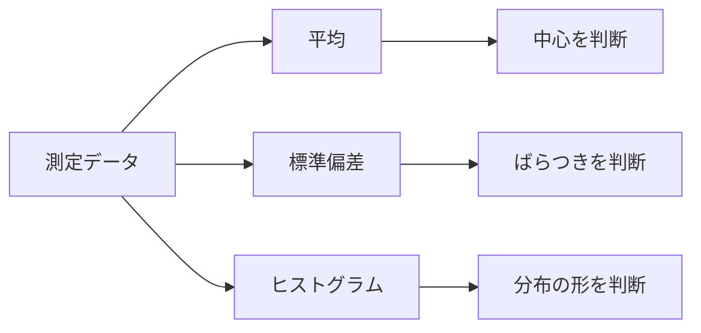

# 第15回 統計と品質管理：平均・標準偏差で「ばらつき」を読む

### ー データを見て、製品が安定しているかを判断する ー

---

## ⏱ 授業時間の目安（100分授業・正味85分）

| 時間 | 内容 |
|---:|---|
| 0〜5分 | 今日のゴール、第14回（行列）の復習と残りスケジュールの確認 |
| 5〜20分 | なぜ統計が必要か？：平均値（中心）と標準偏差（ばらつき） |
| 20〜35分 | 💻 ワーク1：測定データの平均と標準偏差を求める |
| 35〜55分 | 💻 ワーク2：ヒストグラムで分布の「山」を見る |
| 55〜70分 | 規格範囲と合格判定・合格率の計算 |
| 70〜85分 | 💻 ワーク3：1000個のデータで品質を評価する ＆ 第16回への接続 |

---

## 🎯 今日のゴール

今日の授業では、次のことを目標にします。

1. 平均値を「データの中心」として読めるようになる。
2. 標準偏差を「ばらつきの大きさ」として読めるようになる。
3. ヒストグラムを使って、データの分布（山の形）を目で確認できるようになる。
4. 規格範囲に入る割合（合格率）を計算し、品質管理の考え方の基礎をマスターする。

---

## 1. なぜエンジニアの現場に「統計」が必要なのか

製造現場では、同じ部品を作っても、完全に同じ寸法にはなりません。
たとえば、10.00mmの軸を作ろうとしても、実際には、

* 9.98mm
* 10.01mm
* 10.03mm
* 9.99mm

のように少しずつばらつきます。
このとき、1個だけ見ても、その工場が良い製品を作れているかは判断できません。

たくさんのデータ（母集団）をまとめて眺めて、
* 中心はどこか
* ばらつきは大きいか（機械がガタついていないか）
* 規格から外れる不良品はどのくらいあるか

を客観的に判断する必要があります。



---

## 2. 平均値：データの中心

平均値は、データの中心（重心）を表します。

$$\bar{x}=\frac{x_1+x_2+\cdots+x_n}{n}$$

Google Colab では、NumPyを使って次の一行で求められます。

```python
np.mean(data)
```

---

## 3. 標準偏差：ばらつきの大きさ

標準偏差（$\sigma$：シグマ）は、データが平均値の周りにどのくらい散らばっているか（ばらつきの幅）を表します。式はこんな式です（あぁ恐ろしい⋯）。理屈はこうです：

1. 各データから平均を引く ⇒ 平均からのばらつきがでる
2. それを２乗する ⇒プラス・マイナスが関係なくなる
3. それを全部足す
4. データの個数で割る ⇒ ばらつきの平均になる
5. 2 で２乗したのをもとに戻す

$$\sigma = \sqrt{\frac{\Sigma {(x_i - \bar{x}})^2}{n}}$$

* **標準偏差が小さい：** データがそろっている（高品質・安定）
* **標準偏差が大きい：** データが激しくばらついている（低品質・不安定）

Google Colab では、そんな難しいことは関係なく、次の一行で求められます。

```python
np.std(data)
```

---

## 4. 💻 ワーク1：測定データの平均と標準偏差を求める

次のデータは、工場からサンプリングした15個の部品の軸径（単位：mm）です。
NumPyを使って、この工程の「平均値」と「標準偏差」を計算してみましょう。

```python
import numpy as np

# 15個のサンプルデータ
x = np.array([
    10.01, 9.99, 10.02, 10.00, 9.98,
    10.03, 10.01, 9.97, 10.00, 10.02,
    9.99, 10.01, 10.04, 9.98, 10.00
])

mean_x = np.mean(x)
std_x = np.std(x)

print(f"データの個数: {len(x)} 個")
print(f"平均値       : {mean_x:.3f} mm")
print(f"標準偏差 (σ) : {std_x:.3f} mm")
```

#### 🎯 読み取りのポイント

* 平均値が狙い通り 10.00mm に近ければ、中心はズレていません。
* 標準偏差の数値（約 0.018mm）が、この工場の「ばらつきの個性」になります。

---

## 5. 💻 ワーク2：ヒストグラムで分布を見る

数字の羅列だけでは山の形が分かりません。データを区切りごとにカウントした棒グラフ（ヒストグラム）を `Matplotlib` で描画してみましょう。

```python
import matplotlib.pyplot as plt

# binsは棒の数を表します
plt.hist(x, bins=8, color="skyblue", edgecolor="black")
plt.xlabel("diameter [mm]")
plt.ylabel("count")
plt.title("Measurement data")
plt.show()
```

ヒストグラムを見ると、どの範囲にデータが集中しているかが一目でわかります。

---

## 6. 規格範囲と合格判定

製品には、設計上の合格範囲（規格）が決められています。
今回の軸径の規格を以下のように設定します。

$$9.95\mathrm{mm}\leq x\leq 10.05\mathrm{mm}$$

この範囲に入れば合格、外れたら不良品です。Pythonの条件式（ブールインデックス）を使って、15個のデータのうち何個が合格か、合格率は何％かを一瞬で計算させます。

```python
lower = 9.95
upper = 10.05

# & は「かつ（AND）」を意味します
ok = (x >= lower) & (x <= upper)

ok_count = np.sum(ok)        # 合格数
ok_rate = ok_count / len(x)　# 合格率

print("合格数 =", ok_count)
print(f"合格率 = {ok_rate * 100:.1f} %")
```

---

## 7. 💻 ワーク3：データ数を1000個に増やして品質を評価する

実際の現場では、たった15個のデータだけでは本当に安全か判断が難しいです。
そこで、パソコンの中に「平均 10.00mm、標準偏差 0.025mm でばらつく仮想の工場」を作り、1000個の大量の製品を作って未来の品質を予測（シミュレーション）してみましょう。

```python
import numpy as np
import matplotlib.pyplot as plt

N = 1000
# np.random.normal(平均, 標準偏差, 個数) でリアルなばらつきデータを生成
x = np.random.normal(10.00, 0.025, N)

lower = 9.95
upper = 10.05

ok = (x >= lower) & (x <= upper)
ok_rate = np.sum(ok) / N

print(f"1000個の平均値  : {np.mean(x):.3f} mm")
print(f"1000個の標準偏差: {np.std(x):.3f} mm")
print(f"シミュレーション合格率: {ok_rate * 100:.1f} %")

# グラフに規格の「壁」を赤い点線で引いてみよう

plt.hist(x, bins=40, color="lightgreen", edgecolor="black")
plt.axvline(lower, color="red", linestyle="--", label="Lower Limit")
plt.axvline(upper, color="red", linestyle="--", label="Upper Limit")
plt.xlabel("diameter [mm]")
plt.ylabel("count")
plt.title("Quality distribution")
plt.legend()
plt.show()
```

---

## 8. 実験：標準偏差を変えると何が起こるか？

ワーク3のコードの乱数生成の部分（ `np.random.normal` ）の標準偏差を、以下の3パターンに書き換えて、合格率やグラフの形がどう変わるか実験してみましょう。

```python
# パターンA：最先端の超精密な機械に変えた場合（ばらつき小）
x = np.random.normal(10.00, 0.015, N)
```

```python
# パターンB：現在の普通の機械の場合（標準）
x = np.random.normal(10.00, 0.025, N)
```

```python
# パターンC：古くなってガタがきた機械の場合（ばらつき大）
x = np.random.normal(10.00, 0.040, N)
```

#### 💡 わかったこと

標準偏差が小さいほど、データは中心にギュッと集まり、規格の壁（赤い点線）から外れにくくなります（＝合格率が上がる）。

---

## 9. 正規分布をざっくり理解する

部品寸法や測定誤差は、今回見たグラフのように綺麗な左右対称の山型の形状にばらつきます。これを数学では **「正規分布（せいきぶんぷ）」** と呼びます。

細かい難しい数式を覚える必要はありません。工業数学の実務においては、まず次のように脳内に焼き付けてください。

> **「平均値は山の中心、標準偏差は山の広がり（ガタつきの幅）である」**

---

## 10. まとめ

今日登場した統計の武器を整理しておきましょう。

| 統計の道具 | 工学的な意味 | Pythonでの書き方 |
| --- | --- | --- |
| **平均値** | データの中心、狙い通りの場所か | `np.mean(x)` |
| **標準偏差 (σ)** | 製品のばらつき、機械のガタつきの大きさ | `np.std(x)` |
| **ヒストグラム** | ばらつきの「山の形」を目視で確認する | `plt.hist(x)` |
| **合格判定** | 各データが規格の壁の内側にあるか | `(x >= lower) & (x <= upper)` |
| **合格率** | 全体のうち合格品が占める割合 | `np.sum(ok) / N` |

---

## 11. 第16回への接続

次回（第16回）は、今日学んだ「平均・標準偏差・ヒストグラム・合格率」という統計の武器をフルに使った「モンテカルロ・シミュレーション」に挑戦します。

次回は、今回のような単純な「1本の軸」ではなく、「複数のばらつく抵抗が組み合わさった回路設計」を取り上げます。
部品単体のばらつきがシステム全体にどう影響するかをPCの中で何万回も実験して予測する、プロのエンジニア必須のテクニックを学びます！
