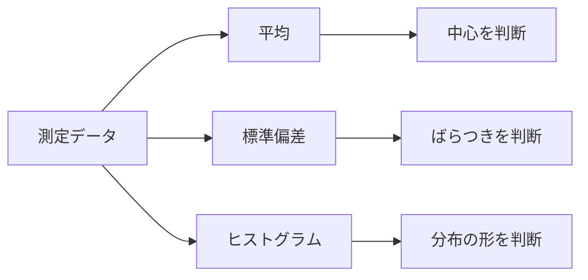

# 第16回 統計と品質管理：平均・標準偏差で「ばらつき」を読む

### ー データを見て、製品が安定しているかを判断する ー

---

## ⏱ 授業時間の目安（100分授業・正味85分）

| 時間 | 内容 |
|---:|---|
| 0〜5分 | 今日のゴール、第15回の復習 |
| 5〜20分 | 平均値：中心を見る |
| 20〜35分 | 標準偏差：ばらつきの大きさを見る |
| 35〜55分 | ヒストグラムで分布を見る |
| 55〜70分 | 規格範囲と不良率を計算する |
| 70〜85分 | 第17回最終レポートへの接続 |

---

## 🎯 今日のゴール

今日の授業では、次のことを目標にします。

1. 平均値を「データの中心」として読めるようになる。
2. 標準偏差を「ばらつきの大きさ」として読めるようになる。
3. ヒストグラムを使って、データの分布を目で確認できるようになる。
4. 規格範囲に入る割合を計算し、品質管理の考え方に触れる。

---

## 1. なぜ統計が必要なのか

製造現場では、同じ部品を作っても、完全に同じ寸法にはなりません。

たとえば、10.00mmの軸を作ろうとしても、実際には、

- 9.98mm
- 10.01mm
- 10.03mm
- 9.99mm

のように少しずつばらつきます。

このとき、1個だけ見ても、工程が良いか悪いかは判断できません。

たくさんのデータを見て、

- 中心はどこか
- ばらつきは大きいか
- 規格から外れるものはどのくらいあるか

を判断する必要があります。



---

## 2. 平均値：データの中心

平均値は、データの中心を表します。

$$
\bar{x}=\frac{x_1+x_2+\cdots+x_n}{n}
$$

Google Colab では、

```python
np.mean(data)
```

で求められます。

---

## 3. 標準偏差：ばらつきの大きさ

標準偏差は、データが平均値の周りにどのくらい散らばっているかを表します。

標準偏差が小さいほど、データはそろっています。

標準偏差が大きいほど、データはばらついています。

Google Colab では、

```python
np.std(data)
```

で求められます。

---

## 4. ワーク1：測定データの平均と標準偏差を求める

次のデータは、ある部品の軸径を測定した結果です。単位は mm です。

```python
import numpy as np

x = np.array([
    10.01, 9.99, 10.02, 10.00, 9.98,
    10.03, 10.01, 9.97, 10.00, 10.02,
    9.99, 10.01, 10.04, 9.98, 10.00
])

mean_x = np.mean(x)
std_x = np.std(x)

print("平均値 =", mean_x, "mm")
print("標準偏差 =", std_x, "mm")
```

### 読み取り

平均値が10.00mmに近ければ、中心は狙い通りです。

標準偏差が小さければ、ばらつきが小さいといえます。

---

## 5. ワーク2：ヒストグラムで分布を見る

```python
import matplotlib.pyplot as plt

plt.hist(x, bins=8)
plt.xlabel("diameter [mm]")
plt.ylabel("count")
plt.title("Measurement data")
plt.show()
```

ヒストグラムを見ると、データがどの範囲に多いかがわかります。

平均値と標準偏差だけでは見えない情報も、グラフにすると見えることがあります。

---

## 6. 規格範囲と合格判定

部品には、合格範囲が決められています。

たとえば、軸径の規格を

$$
9.95\mathrm{mm}\leq x\leq 10.05\mathrm{mm}
$$

とします。

この範囲に入れば合格です。

```python
lower = 9.95
upper = 10.05

ok = (x >= lower) & (x <= upper)

ok_count = np.sum(ok)
ok_rate = ok_count / len(x)

print("合格数 =", ok_count)
print("合格率 =", ok_rate * 100, "%")
```

---

## 7. ワーク3：データ数を増やして品質を評価する

実際の現場では、15個だけでは判断が難しいことがあります。

そこで、平均10.00mm、標準偏差0.025mmの工程から、1000個のデータを作って評価してみます。

```python
import numpy as np
import matplotlib.pyplot as plt

N = 1000
x = np.random.normal(10.00, 0.025, N)

lower = 9.95
upper = 10.05

ok = (x >= lower) & (x <= upper)
ok_rate = np.sum(ok) / N

print("平均値 =", np.mean(x), "mm")
print("標準偏差 =", np.std(x), "mm")
print("合格率 =", ok_rate * 100, "%")

plt.hist(x, bins=40)
plt.axvline(lower, linestyle="--")
plt.axvline(upper, linestyle="--")
plt.xlabel("diameter [mm]")
plt.ylabel("count")
plt.title("Quality distribution")
plt.show()
```

---

## 8. 標準偏差を小さくすると何が起こるか

次に、標準偏差を変えてみましょう。

```python
x = np.random.normal(10.00, 0.015, N)
```

```python
x = np.random.normal(10.00, 0.025, N)
```

```python
x = np.random.normal(10.00, 0.040, N)
```

標準偏差が小さいほど、データは平均値の近くに集まります。

つまり、規格から外れにくくなります。

---

## 9. 正規分布をざっくり理解する

部品寸法や測定誤差は、山のような形にばらつくことがあります。

このような分布を、正規分布と呼びます。

正規分布では、平均値の近くにデータが多く、平均値から遠いデータは少なくなります。

細かい式を覚える必要はありません。

工業数学では、まず次のように理解してください。

> 平均値は山の中心、標準偏差は山の広がりである。

---

## 10. まとめ

今日の内容を整理します。

| 内容 | 意味 | Colabでの計算 |
|---|---|---|
| 平均値 | データの中心 | `np.mean(x)` |
| 標準偏差 | ばらつきの大きさ | `np.std(x)` |
| ヒストグラム | 分布を目で見る | `plt.hist(x)` |
| 合格判定 | 規格に入るか調べる | `(x >= lower) & (x <= upper)` |
| 合格率 | 合格数 ÷ 全体数 | `np.sum(ok) / N` |

---

## 11. 第17回への接続

次回は最終レポートです。

第16回で学んだ

- 平均値
- 標準偏差
- ヒストグラム
- 合格率

を使って、品質・設計シミュレーションの結果をレポートにまとめます。

レポートでは、単にコードを実行するだけでなく、

> この設計は規格を満たす可能性が高いか

を、数値とグラフに基づいて説明します。
