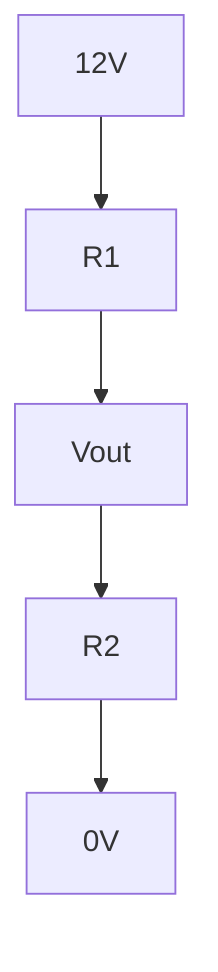

# 第17回 最終レポート：品質・設計シミュレーション

### ー データの妥当性を判断し、技術報告書としてまとめる ー

---

## ⏱ 授業時間の目安（100分授業・正味85分）

| 時間 | 内容 |
|---:|---|
| 0〜10分 | 最終レポートの目的と評価観点 |
| 10〜25分 | 課題設定：分圧回路のばらつき評価 |
| 25〜45分 | Colabでシミュレーションを実行 |
| 45〜65分 | 平均・標準偏差・合格率を計算 |
| 65〜80分 | Markdownで考察を書く |
| 80〜85分 | 提出前チェック |

---

## 🎯 今日のゴール

今日の授業では、次のことを目標にします。

1. 第16回の統計と品質管理の考え方を使って、設計の良し悪しを評価する。
2. シミュレーション結果を、平均・標準偏差・合格率で説明できるようになる。
3. グラフと文章を組み合わせて、技術報告書としてまとめる。
4. `.ipynb` ファイルを最終レポートとして提出できる状態にする。

---

# 第16・17回 合同提出課題（最終レポート）

## 提出物

Google Colab で作成した `.ipynb` ファイルを提出すること。

ファイル名の例：

```text
学籍番号_氏名_第16_17回最終レポート.ipynb
```

---

## 1. 課題テーマ：分圧回路のばらつき評価

センサーやマイコン回路では、抵抗を使って電圧を分けることがあります。

次のような分圧回路を考えます。



出力電圧は、次の式で求められます。

$$
V_{out}=V_{in}\frac{R_2}{R_1+R_2}
$$

今回は、

$$
V_{in}=12\mathrm{V}
$$

$$
R_1=14\mathrm{k}\Omega
$$

$$
R_2=10\mathrm{k}\Omega
$$

として、だいたい5Vを作る設計を考えます。

---

## 2. ただし、抵抗値にはばらつきがある

現実の抵抗は、表示どおりぴったりの値とは限りません。

今回は、抵抗値が次のようにばらつくとします。

| 抵抗 | 平均値 | 標準偏差 |
|---|---:|---:|
| R1 | 14.0 kΩ | 0.05 kΩ |
| R2 | 10.0 kΩ | 0.05 kΩ |

出力電圧が、

$$
4.8\mathrm{V}\leq V_{out}\leq 5.2\mathrm{V}
$$

なら合格とします。

---

## 3. まずは基準値で計算する

```python
Vin = 12
R1 = 14.0
R2 = 10.0

Vout = Vin * R2 / (R1 + R2)

print("基準値での出力電圧 =", Vout, "V")
```

### 確認

この時点で、基準値が規格範囲に入っているか確認します。

ただし、基準値が合格していても、ばらつきによって不合格が出る可能性があります。

---

## 4. シミュレーションで10000個の回路を仮想的に作る

```python
import numpy as np
import matplotlib.pyplot as plt

N = 10000
Vin = 12

R1 = np.random.normal(14.0, 0.05, N)
R2 = np.random.normal(10.0, 0.05, N)

Vout = Vin * R2 / (R1 + R2)

print("最初の10個のVout")
print(Vout[:10])
```

---

## 5. 平均・標準偏差・合格率を求める

```python
lower = 4.8
upper = 5.2

mean_v = np.mean(Vout)
std_v = np.std(Vout)

ok = (Vout >= lower) & (Vout <= upper)
ok_rate = np.sum(ok) / N

print("Voutの平均 =", mean_v, "V")
print("Voutの標準偏差 =", std_v, "V")
print("合格率 =", ok_rate * 100, "%")
```

---

## 6. ヒストグラムで確認する

```python
plt.hist(Vout, bins=40)
plt.axvline(lower, linestyle="--")
plt.axvline(upper, linestyle="--")
plt.xlabel("Vout [V]")
plt.ylabel("count")
plt.title("Distribution of Vout")
plt.show()
```

ヒストグラムに、規格下限と規格上限の線を入れると、合格範囲にどのくらい入っているかを目で確認できます。

---

## 7. 設計変更の検討

もし合格率が低い場合は、設計変更を検討します。

たとえば、抵抗のばらつきが小さい部品を使うとします。

```python
R1 = np.random.normal(14.0, 0.02, N)
R2 = np.random.normal(10.0, 0.02, N)

Vout = Vin * R2 / (R1 + R2)

mean_v = np.mean(Vout)
std_v = np.std(Vout)
ok = (Vout >= lower) & (Vout <= upper)
ok_rate = np.sum(ok) / N

print("変更後のVout平均 =", mean_v, "V")
print("変更後のVout標準偏差 =", std_v, "V")
print("変更後の合格率 =", ok_rate * 100, "%")

plt.hist(Vout, bins=40)
plt.axvline(lower, linestyle="--")
plt.axvline(upper, linestyle="--")
plt.xlabel("Vout [V]")
plt.ylabel("count")
plt.title("Distribution of Vout after design change")
plt.show()
```

---

## 8. レポート構成

Colab の Markdown セルを使って、次の構成でレポートを作成しなさい。

---

### 1. 目的

例：

```text
本レポートでは、分圧回路における抵抗値のばらつきが出力電圧に与える影響を、シミュレーションによって評価する。
```

---

### 2. 使用した式

次の式を書くこと。

$$
V_{out}=V_{in}\frac{R_2}{R_1+R_2}
$$

また、合格条件を書くこと。

$$
4.8\mathrm{V}\leq V_{out}\leq 5.2\mathrm{V}
$$

---

### 3. シミュレーション条件

次の内容を書くこと。

- 試行回数
- 入力電圧
- R1の平均と標準偏差
- R2の平均と標準偏差
- 合格条件

---

### 4. 結果

次の内容を書くこと。

- Voutの平均値
- Voutの標準偏差
- 合格率
- ヒストグラム

---

### 5. 考察

考察では、少なくとも次の内容を書くこと。

1. 平均値は5Vに近いか
2. 標準偏差は大きいか小さいか
3. 合格率は十分高いか
4. 設計変更によって何が改善したか

---

## 9. 考察文の例

```text
シミュレーションの結果、Voutの平均値は○○V、標準偏差は○○Vであった。
規格範囲を4.8V以上5.2V以下とした場合、合格率は○○%であった。
ヒストグラムを見ると、多くのデータが5V付近に集まっており、規格範囲内に収まっていることを確認した。
抵抗値の標準偏差を小さくした条件では、Voutの標準偏差も小さくなり、合格率が改善した。
したがって、ばらつきの小さい抵抗を使うことは、出力電圧の安定化に有効である。
```

数値は、自分の実行結果に置き換えること。

---

## 10. 提出前チェックリスト

提出前に、次の項目を確認しなさい。

- [ ] ファイル名に学籍番号と氏名が入っている
- [ ] 目的を書いている
- [ ] 使用した式を書いている
- [ ] シミュレーション条件を書いている
- [ ] コードを実行している
- [ ] 平均値・標準偏差・合格率を書いている
- [ ] ヒストグラムを表示している
- [ ] 結果に基づく考察を書いている
- [ ] 「〜だと思う」ではなく、「〜を確認した」「〜である」と書いている

---

## 11. まとめ

この課題で行っていることは、実際のエンジニアリングで非常によく使われる流れです。


計算そのものよりも大切なのは、

> 条件を明確にし、結果を数値で示し、妥当性を説明する

ことです。

これが、工業数学を現場で使うということです。
